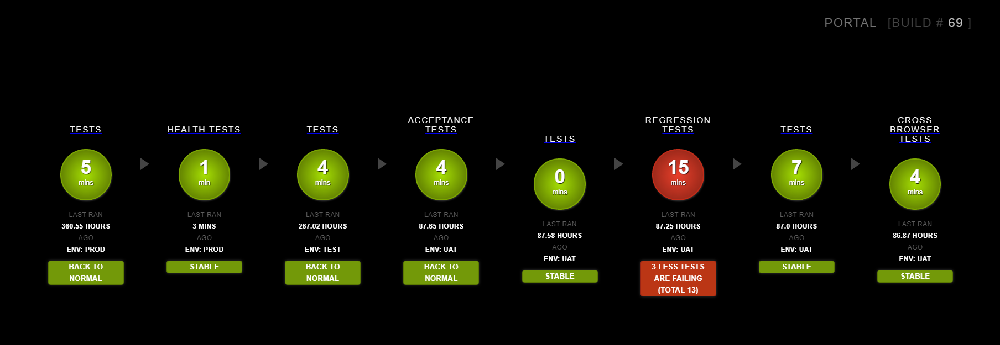

[](https://maven-badges.herokuapp.com/maven-central/com.pacificwebconsulting.core/continuous-monitor)

[](https://opensource.org/licenses/BSD-3-Clause)

Got a question?  [Email us](http://www.pacificwebconsulting.com/contact/) or reach out on [LinkedIn](https://www.linkedin.com/in/alombardo/) 

# Introduction
A Jenkins continuous build/test monitor plugin that creates color-coded dashboards.

# Build Project
1.  Pull the latest continuous-monitor source from GitHub to your local machine
2.  To build the plugin to be used with Jenkins, you will need to first install [Apache Maven](http://maven.apache.org/download.cgi/) 
3.  Navigate to the continuous-monitor directory on your machine. 
4.  Edit the pom.xml file in the continuous-monitor root directory.  You will need to change the version element's value, located 
underneath the comment "The version of Hudson this plugin will run on". The version number should match your version 
of Jenkins.  You can determine your version of Jenkins, by looking at the bottom right of a Jenkins page.
5.  Perform Maven on this directory
```
mvn clean install 
``` 
6.  Navigate to the continuous-monitor/target directory on your machine.
7.  An .hpi file should be created in the target directory. 
```
ls -al target/continuous-monitor.hpi
```
8.  You can then upload the plugin via the "Advanced" tab on the Jenkins Manage Plugins page.

# Configuration
Dashboard allows for monitoring up to 8 Jenkins jobs.  Simply, navigate to the /configure URI once you've created
your dashboard to Edit.

# Custom Dashboards



